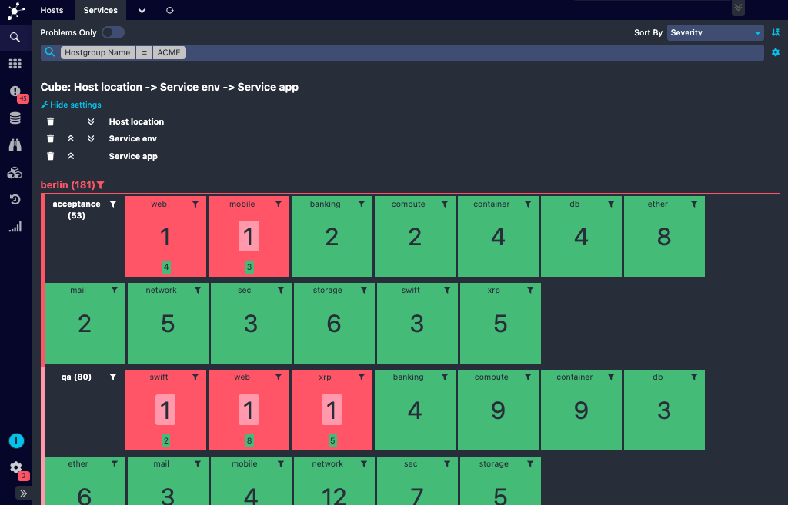
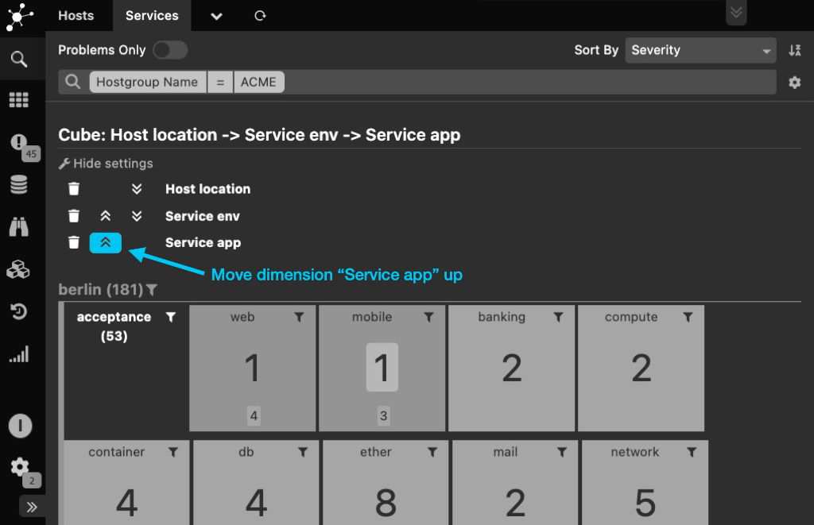

The Icinga Web 2 Cube
=====================

The Cube is a tiny but useful [Icinga Web 2](https://github.com/Icinga/icingaweb2)
module. It currently shows host statistics (total count, health) grouped by
various custom variables in multiple dimensions.

It will be your new best friend in case you are running a large environment and
want to get a quick answers to questions like:

* Which project uses how many servers per environment at which location/site?
  * Who occupies most servers?
  * How many of those are used in production?
  * Which project has only development and test boxes? 
* Which operating system is used for which project and in which environment?
  * Do we still have Debian Lenny?
  * Which projects are to blame for this?
  * Do we have applications where the operating systems used differ in staging
    and production? 
* Which project uses which operating system version for which application
  * Which projects have homogeneous environments?
  * Which projects are at a consistent patch level?
  * How many RHEL 6 variants (6.1, 6.2, 6.3...) do we use?
  * Who is running the oldest ones? In production?
* Which projects are still using physical servers in which environment?

For Businessmen - Drill and Slice
---------------------------------

Get answers to your questions. Quick and fully autonomous, using the cube
requires no technical skills. Choose amongst all available dimensions and rotate
the Cube to fit your needs.

Want to drill down? Choose a slice and get your
 answers:

All facts configured for systems monitored by [Icinga](https://www.icinga.com/)
 can be used for your research.

For Icinga Director users
-------------------------

In case you are using the [Icinga Director](https://github.com/Icinga/icingaweb2-module-director),
in addition to the multi-selection/edit feature the cube provides a nice way to
modify multiple hosts at once.

For Developers
--------------

Our main intention when developing the Cube was too provide a modular small
framework allowing you to drill into data provided from various sources. So it
provides hooks for custom Cubes, related Renderers or just custom action links.

For DBAs
--------

Yes, it's mostly what the name suggests. Just a configurable Rollup Cube,
providing a frontend allowing you to add and flip dimensions at will. You
can slice and dice your data, drill down and pivot/rotate the whole cube.

Installation
------------

Nothing special. As with every Icinga Web 2 module, drop this to one of your
`modules` folders and make sure that the folder name is `cube`.

Configuration
-------------

Enable the module. That's it.

Permissions
-----------

Someone able to access the cube will see statistics for **all** available
objects. Restrictions applied to other modules will have no effect, at lease
not unless those modules provide their own Cube hooks taking care about such.

Changes
-------

### v1.0.1

* Fix layout when rendered to a Dashboard
* Fix PostgreSQL support
* Fix problems with special characters
